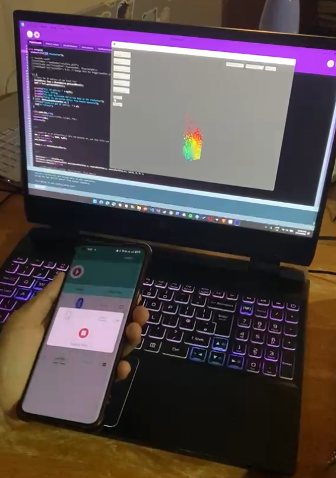

# Flux Deluxe: A SPH Fluid Simulation

A real-time 3D Smoothed Particle Hydrodynamics (SPH) fluid simulation built in Processing. Particles are confined to a rotatable box boundary and respond to gravity, pressure, and viscosity forces. The simulation can be controlled interactively via keyboard, on-screen UI, or a phone's motion sensors over UDP.

This project was awarded a **High First-Class grade** as part of final-year coursework, in recognition of its technical implementation of real-time SPH simulation, spatial optimisation, and interactive system design.

---

<video src="https://github.com/user-attachments/assets/a839d9fa-26ee-4472-887d-94d3a06466d0" width="80%" controls></video>

---

## Features

- **SPH physics** - density, pressure (Tait equation of state), and viscosity forces computed per-step using the Poly6, Spiky, and viscosity kernels
- **Spatial hashing** - particles bucketed into a hash grid per frame; only neighbouring cells are queried, keeping neighbour searches near O(n)
- **Rotatable boundary** - the container can be tilted on X/Y axes via arrow keys or phone gyroscope; collision response is resolved in the boundary's local frame then transformed back to world space
- **Phone input via UDP** - streams accelerometer, gyroscope, and gravity sensor data from an Android device over a local network using the *Serial Sensor* app (Amazon Appstore). Gyro data rotates the container; linear acceleration is separated from gravity for clean motion input
- **Interactive UI** - sliders and menus for viscosity, gravity, smoothing length, wall friction, restitution, particle count (100–10 000), and boundary size (Small / Medium / Large / Default); Reset button reinitialises the simulation without restarting the sketch
- **Speed-based particle colouring** - particles shade from blue (slow) → green → yellow → red (fast) using a three-segment lerp

---

## Dependencies

- [Processing 4](https://processing.org/) with the **P3D** renderer
- [UDP library for Processing](http://ubaa.net/shared/processing/udp/) — `import hypermedia.net.*`
- A simulation library created by Simon Schofield exposing `SimUI`, `SimCamera`, and `SimUIEvent`

---

## Running the Sketch

1. Open the sketch folder in the Processing IDE.
2. Ensure the UDP library is installed in your Processing IDE.
3. Press **Run**. The console will print the machine's local IP address and port (`6666`).
4. Adjust parameters with the on-screen sliders and menus.

### Phone Control (optional)

1. Install *Serial Sensor* from the Amazon Appstore on an Android device.
2. Connect the phone to the same local network as the machine running the sketch.
3. Point the app at the IP and port printed in the console.
4. Enable **PhoneInput** via the toggle button in the UI. The container will respond to gyroscope rotation.

---

---

## Controls

| Input | Action |
|---|---|
| Arrow keys | Rotate the boundary container |
| UI sliders | Adjust viscosity, gravity, smoothing length, wall friction, restitution, phone input strength |
| Particle Count menu | Set particle count (applied on Reset) |
| Boundary Size menu | Set container dimensions (applied on Reset) |
| Flip Gravity toggle | Invert gravity direction |
| PhoneInput toggle | Enable/disable UDP motion input |
| Reset button | Reinitialise simulation with current settings |
